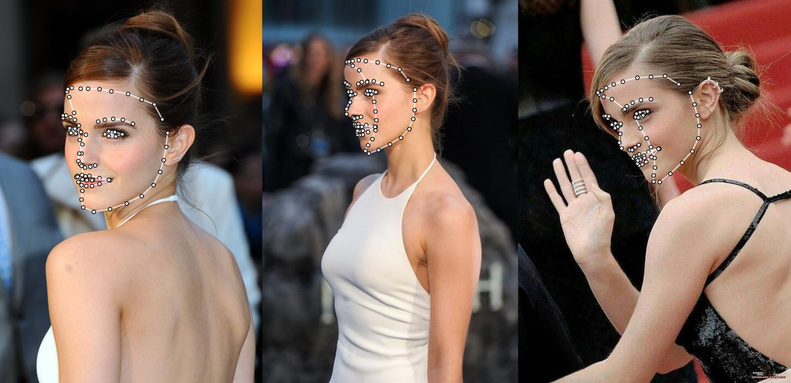

# Towards Fast, Accurate and Stable 3D Dense Face Alignment

在原有项目的基础上，将68个人脸关键点拓展到81个，另外13个为额头关键点。

感谢[cleardusk](https://guojianzhu.com)的工作

## Requirements

Build dependencies by referring to the [original project](https://github.com/cleardusk/3DDFA_V2.git)

```shell script
git clone https://github.com/chenjun2hao/3DDFA_V2.git
cd 3DDFA_V2
```

## Run demos

```shell script
# 1. origin 68 landmarks
python demo.py -c configs/mb1_120x120.yml -f examples/inputs/emma.jpg -o 2d_sparse # -o [2d_sparse, 2d_dense, 3d, depth, pncc, pose, uv_tex, ply, obj]

# 2. the 81 landmarks
python demo.py -c configs/mb1_120x120_81landmarks.yml -f examples/inputs/emma.jpg -o 2d_sparse
```

<p align="center">
  
</p>


<p align="center">
  
</p>

## other 
The index of 81 key points in bfm is
```
array([[21874, 22150, 21654, 21037, 43237, 44919, 46167, 47136, 47915,
        48696, 49668, 50925, 52614, 33679, 33006, 32470, 32710, 38696,
        39393, 39783, 39988, 40155, 40894, 41060, 41268, 41662, 42368,
         8162,  8178,  8188,  8193,  6516,  7244,  8205,  9164,  9884,
         2216,  3887,  4921,  5829,  4802,  3641, 10456, 11354, 12384,
        14067, 12654, 11493,  5523,  6026,  7496,  8216,  8936, 10396,
        10796,  9556,  8837,  8237,  7637,  6916,  5910,  7385,  8224,
         9065, 10538,  8830,  8230,  7630, 21462, 38570, 39258, 39696,
        40022, 40321, 40503, 40737, 40982, 41368, 41849, 42465, 32941]])
```


## Citation

If your work or research benefits from this repo, please cite two bibs below : ) and 🌟 this repo.

    @inproceedings{guo2020towards,
        title =        {Towards Fast, Accurate and Stable 3D Dense Face Alignment},
        author =       {Guo, Jianzhu and Zhu, Xiangyu and Yang, Yang and Yang, Fan and Lei, Zhen and Li, Stan Z},
        booktitle =    {Proceedings of the European Conference on Computer Vision (ECCV)},
        year =         {2020}
    }

    @misc{3ddfa_cleardusk,
        author =       {Guo, Jianzhu and Zhu, Xiangyu and Lei, Zhen},
        title =        {3DDFA},
        howpublished = {\url{https://github.com/cleardusk/3DDFA}},
        year =         {2018}
    }

